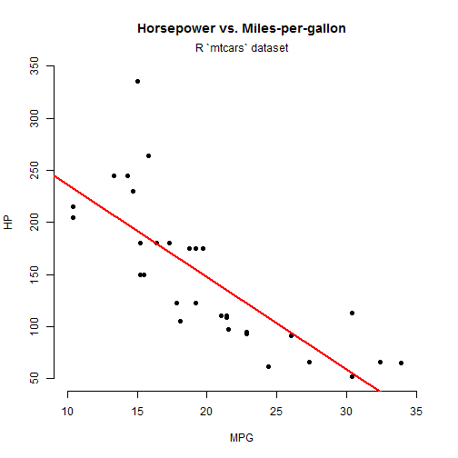
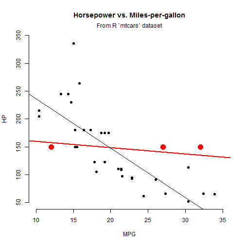

Presentation on a Shiny App: Adding Observations to a Model
========================================================
author: Paul Clark
date: 2017-06-04
autosize: true

See the app at: <<https://clarpaul.shinyapps.io/add_point/>>


What the app does: show the effect of adding points to a regression model
========================================================

- Displays a 2-D scatterplot with initial regression line
- Adds observations to the plot at clicked points
- Shows the coordinates of the most recently added points
- With addition of each new observation, displays and updates...
  * the regression line for the scatter plot
  * the equation for the regression line
  * the correlation coefficient and p-value
- Also provides...
  * a button to start over
  * a check-box to show or hide the original trend line

Code for initial regression plot
========================================================

```r
plot(mtcars$mpg, mtcars$hp, main =
        "Horsepower vs. Miles-per-gallon", 
        xlab = "MPG", ylab = "HP", 
        bty = "n", pch = 16,
        xlim = c(10, 35), ylim = c(50, 350))
mtext("From R `mtcars` dataset")
model1 <- lm(hp ~ mpg, data = mtcars)
abline(model1, col = "red", lwd = 2)
```

  
Initial regression plot
========================================================


  
See the source file to confirm that this plot is dynamically generated from code 

Regression plot after clicking three points
========================================================


  
  
Thank you!  
Page 5 of 5, counting the title slide as 1 :)
